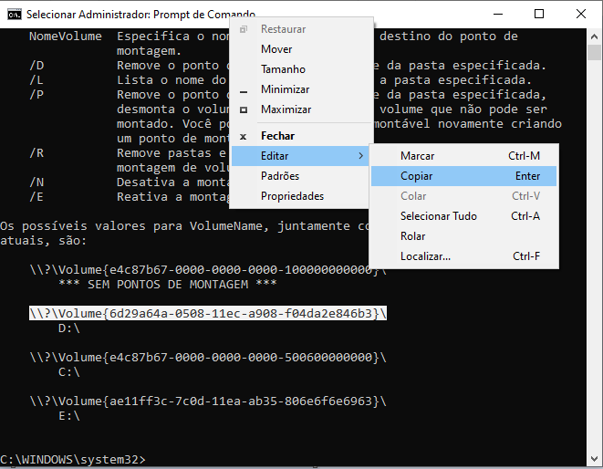
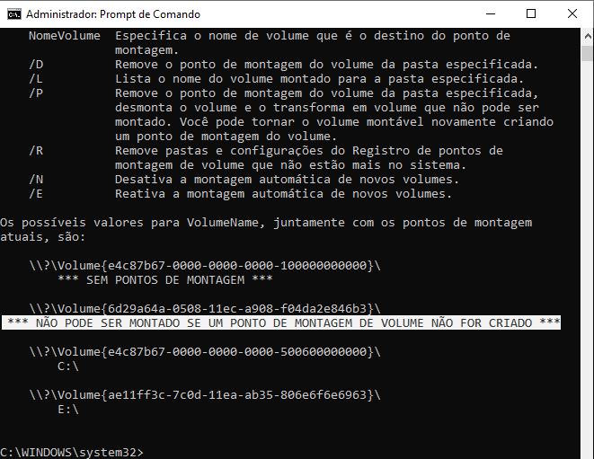
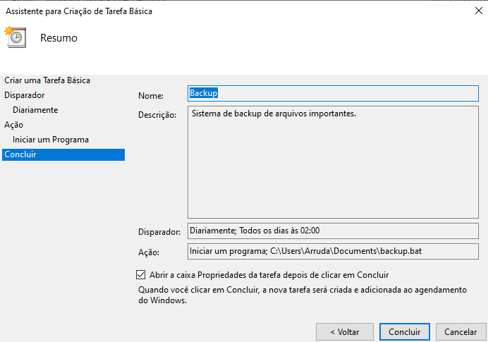
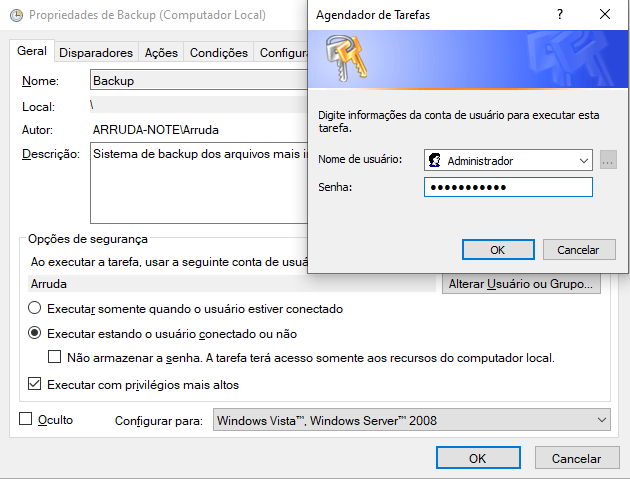

# DESENVOLVIMENTO DE UM ARQUIVO DE LOTE PARA BACKUP DE ARQUIVOS DO WINDOWS EM DISPOSITIVO EXTERNO (PASSO A PASSO): 

Olá, bem vindos ao meu tutorial de Backup.  
Neste tutorial você aprenderá a fazer um arquivo de lote (.bat) para proceder um backup de dados automaticamente.

  >*Atenção: Os comando estarão sempre *`destacados desta forma`*, caso se sinta um pouco perdido, não se preocupe, ao final serão disponibilizados todos os comandos em sequência. O objetivo do texto é explicar como cada comando funciona.   Tome muito cuidado ao realizar estes comandos, evitando a exclusão de arquivos importantes que possam estar na Unidade Externa. Recomendamos, inclusive, que tal unidade seja exclusiva para este backup e que seja formatada antes do seu uso.*

* Escreva na primeira linha a letra da TUA unidade do dispositivo externo (HD Externo ou PenDrive).   --> `D:` 
* Em seguida escreva o comando *set filedatetime=%date%*. Este comando irá criar uma "variável" com o dia atual.  --> `set filedatetime=%date%`
* Agora escreva *set filedatetime=%filedatetime:~6,4%%filedatetime:~3,2%%filedatetime:~0,2%*. Este comando irá tirar as barras da data copiada, tornando a variável filedatetime um texto limpo.   --> `set filedatetime=%filedatetime:~6,4%%filedatetime:~3,2%%filedatetime:~0,2%`
* Em seguida escreva *mkdir %filedatetime%*. Este comando irá criar uma pasta tendo como nome o dia de hoje.   --> `mkdir %filedatetime%` </h2>
* Agora vamos usar um comando nativo do Windows, que antigamente era conhecido como *`xcopy`*, e que agora chama-se *`robocopy`*, para copiar dos dados desejados.

   > Onde aparece descrito como "tua_pasta" é a pasta de onde você quer fazer o backup. É preciso copiar o caminho inteiro.   E na pasta destino também é preciso repetir o nome da pasta, caso contrário os dados serão copiados para a uma pasta anterior.
* Ao final do comando, usa-se a opção "/E", que permite copiar todas as subpastas (inclusive as vazias).   --> `robocopy "C:\Tua_Pasta" "D:\%filedatetime%\Tua_Pasta" /E`
  > Você pode adicionar mais pastas no backup, lembrando que as sub-pastas já serão copiadas.   `robocopy "C:\Pasta01" "D:\%filedatetime%\Pasta01" /E`   `robocopy "C:\Pasta02" "D:\%filedatetime%\Pasta02" /E`   Caso você queria conhecer melhor o comando "robocopy", acesse o seu Prompt de Comando e digite `robocopy/?`

### Mas as vezes, apenas fazer o backup não é o suficiente para proteger os seus arquivos. Lembre de que existem códigos maliciosos que criptografam com senha TODOS os arquivos importantes de um computador invadido com uma senha, que só é fornecida mediante um pagamento (como é o caso do *WannaCry*).   E se o dispositivo externo permanecer conectado ao computador, os dados que estão nele também serão criptografados por este *Ransomware*.    Para tentar evitar tal ataque ao dispositivo externo é preciso *"desplugá-lo"* sempre que não estiver fazendo o backup ou que não esteja sendo utilizado. Mas fazer isto manualmente pode ser um tanto trabalhoso.   Diante disso, pensei em *"desmontar"* tal unidade automaticamente. Abaixo vou explicar como proceder:
* Conecte o dispositivo na porta USB e depois disso, na barra de pesquisa do Windows, digite `cmd`. Vai aparecer a opção "Prompt de Comando", na coluna lado, clique em "Executar como Administrador" e depois em "Sim".   Na tela que abriu, digite *`mountvol`* e em seguida "Enter".   Ao final irão aparecer as unidades conectadas, indicando a letra da unidade e o código do volume. 
  > No meu caso a unidade em questão é a D:\\, mas caso você ainda tenha dúvida de qual é a tua unidade, basta desconectá-la do computar, executar novamente o comando *`mountvol`* e ver qual unidade não está mais aparecendo.

* Agora precisamos anotar qual é a unidade e qual é o volume. No caso do volume, precisamos copiar a linha inteira de descrição do mesmo.   Nos Sistema Operacionais mais novos (Windows 10 e 11), basta selecionar com o mouse e pressionar "Ctrl + C" ou simplesmente "Enter". Caso a sua versão seja anterior, após selecionar, clique com o botão direito do mouse na barra principal (onde agora aparece escrito "Selecionar Administrador: Prompt de Comando"), vá em Editar e depois copiar.  

  >*Atenção: Salve esta informação do volume em um arquivo de forma que possa recuperá-lo facilmente.   Pois vai precisar dela para *"remontar"* a unidade.*

* O comando para "desmontar" a unidade é *`mountvol D: /p`*, onde D: é a unidade do disposito externo.  E o comando para "montar" a unidade é *`mountvol D: volume`*, no **MEU** caso ficaria assim:
   Para montar   --> `mountvol D: \\?\Volume{6d29a64a-0508-11ec-a908-f04da2e846b3}\`
   Para desmontar   --> `mountvol D: /p`

  >*Atenção: Caso você tenha desmontado a unidade. Não adianta desconectar e conectar novamente que ela não aparecerá. SOMENTE "remontando" tal unidade é que ela voltará a aparecer no referido computador. Veja abaixo como é exibido uma unidade que não foi "remontada", ao executar novamente o comando `mount`.*   

### Resolvido este problema, encontramos mais um desafio. Caso seja programado um backup por dia, em um determinado tempo a unidade externa irá ocupar todo o espaço livre e começará a dar erro ao tentar fazer novos backups.   Para resolver isso, serão criados alguns comandos que vão determinar qual a pasta mais antiga e excluí-la:

* Estando na unidade externa (no meu caso D:\), para listar as pastas por ordem de criação, utiliza-se o comando *`dir /w /b /od`*.   Mas para poder utilizá-lo para excluir a pasta mais antiga, vamos "enviar" este comando para um arquivo de texto, da seguinte forma: *`dir /w /b /od > linha.txt`*, agora temos a lista ordenada dos arquivos em um arquivo de texto.   Para extrair somente a primeira linha, vamos executar os comandos *`set /p linha=<linha.txt`*, onde a variável *linha* terá, agora, a informação desejada.   Depois, vamos dar o comando para apagar a pasta: *`rmdir /s /q %linha%`*.   E não podemos esquecer que excluir, também, o arquivo de texto gerado, senão um dia ele se tornará o arquivo mais antigo e será excluído no lugar da pasta deseja. Fazemos isto através do comando *`del linha.txt`*.

  >*Atenção: Recomenda-se, mais uma vez, que esta unidade externa de backup seja usada exclusivamente para isto que não tenha nenhuma outras pastas ou arquivos gravados no diretório raiz. Pois os comandos repassados podem EXCLUIR tais dados.

### Agora que acredito que esteja tudo explicado, vamos aos comandos organizados em um bloco de notas (notepad).   Mas ainda não salve o arquivo, precisamos de mais um detalhe para poder salvar corretamente.   Perceba que para "comentar uma linha", usamos o comando REM. Seguem as linhas ordenadas:

##### backup.bat 
  > rem ESTE É PROCESSO PARA REMONTAR A UNIDADE DE BACKUP  mountvol D: \\?\Volume{6d29a64a-0508-11ec-a908-f04da2e846b3}\   rem ESTE É PROCESSO PARA TRANSFERIR OS ARQUIVOS PARA O HD EXTERNO D: set filedatetime=%date% set filedatetime=%filedatetime:~6,4%%filedatetime:~3,2%%filedatetime:~0,2% mkdir %filedatetime% robocopy "C:\Users\Arruda\Documents" "D:\\%filedatetime%\Documentos" /E robocopy "C:\Users\Arruda\Downloads"  "D:\\%filedatetime%\Downloads" /E  rem ESTE É O PROCESSO PARA A EXCLUSÃO DA PASTA MAIS ANTIGA D: dir /w /b /od > linha.txt set /p linha=<linha.txt rmdir /s /q %linha% del linha.txt  rem ESTE É O PROCESSO PARA DESMONTAR A UNIDADE DE BACKUP mountvol D: /p

### Agora, ao salvar, verifique corretamente o destino aonde este arquivo será salvo e no campo onde digita-se o nome do arquivo, você vai precisar usar aspas para salvar o arquivo com outra extensão, ou seja, ao invés de salvar como .txt, você precisa salvar como .bat.   Sendo assim, ao salvar, escreva "backup.bat".

### Você também pode criar dois arquivos de lote para "montar" e "desmontar" a Unidade Externa:
* Lembre-se que eles precisam ser "Executados como Administrador" e as informações de Unidade e Volume que aparecem aqui são as **MINHAS**.
##### montar.bat
  > rem ESTE É PROCESSO PARA MONTAR A UNIDADE DE BACKUP   mountvol D: \\?\Volume{6d29a64a-0508-11ec-a908-f04da2e846b3}\
##### desmontar.bat
  > rem ESTE É PROCESSO PARA REMONTAR A UNIDADE DE BACKUP   mountvol D: /p
 

### Para encerrar, precisaremos, agora, agendar a execução de tal arquivo. 

* Para isto, na barra de pesquisa do Windows, digite "Agendador de Tarefas" e abra-o.
* Agora clique em Criar Tarefa Básica.
* Em nome dê um nome para a tarefa (ex.: Backup), se quiser, escreva uma descrição e clique em Avançar.
* Na próxima tela, escolha com que frequência você deseja executar o arquivo de lotes (Ex.: Diariamente) e clique em Avançar.
* Em seguida escolha o dia em que ele começará a fazer o backup e a hora, preferencialmente uma hora que ninguém esteja usando os dados (Ex. 02:00) e clique em Avançar.
* Em Ação, mantenha selecionada a opção "Iniciar um programa e clique em Avançar
* Agora clique em procurar e localize o seu arquivos backup.bat, em seguida em Abrir e depois em Avançar.
* Confira as informações e antes de clicar em concluir, ative a opção "Abrir a caixa Propriedades da tarefa depois de clicar em Concluir.  
* > Caso você já tenha pressionado Enter ou clicado em Concluir antes de ativar tal opção, sem problemas, basta dar dois cliques sobre a tarefa criada.
* Abrirá uma tela com a guia Geral. Lembra que para executar o comando *`mountvol`* precisamos Executar como Administrador? Então, para que este arquivo de lotes seja executado sem erros, é preciso que ele esteja com privilégios de Administrador.
* Selecione as opções "Executar estando o usuário conectado ou não" e "Executar com privilégios mais altos".
* Ao pressionar OK, ele vai pedir que digite a senha do Administrador, digite a senha e pressione OK e depois OK novamente.   
### PRONTO, FINALMENTE O SEU PROCESSO DE BACKUP ESTÁ PRONTO.
