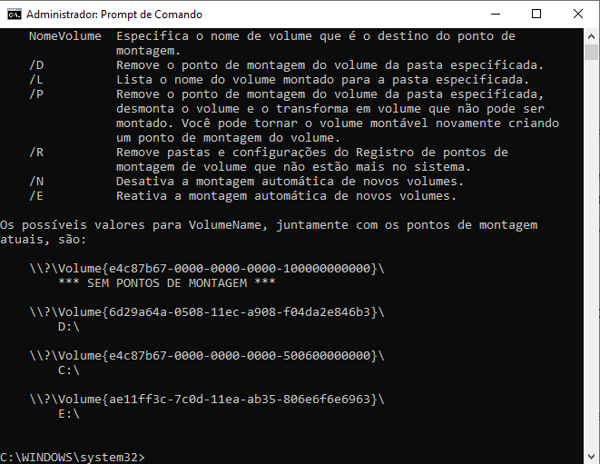

# DESENVOLVIMENTO DE UM ARQUIVO DE LOTE PARA BACKUP DE ARQUIVOS DO WINDOWS EM DISPOSITIVO EXTERNO (PASSO A PASSO): 

Olá, bem vindos ao meu tutorial de Backup.  
Neste tutorial você aprenderá a fazer um arquivo de lote (.bat) para proceder um backup de dados automaticamente.

  >*Atenção: Todas as vezes que aparecer "-->" significa que é o exemplo do comando descrito (a cada comando, dê um Enter), mas não se preocupe, ao final serão disponibilizados todos os comandos em sequência.*

* Abra o bloco de notas e escreva na primeira linha a letra da TUA unidade do dispositivo externo (HD Externo ou PenDrive)   --> `D:` 
* Em seguida escreva o comando *set filedatetime=%date%*. Este comando irá criar uma "variável" com o dia atual.  --> `set filedatetime=%date%`
* Agora escreva *set filedatetime=%filedatetime:~6,4%%filedatetime:~3,2%%filedatetime:~0,2%*. Este comando irá tirar as barras da data copiada, tornando a variável filedatetime um texto limpo.   --> `set filedatetime=%filedatetime:~6,4%%filedatetime:~3,2%%filedatetime:~0,2%`
* Em seguida escreva *mkdir %filedatetime%*. Este comando irá criar uma pasta tendo como nome o dia de hoje.   --> `mkdir %filedatetime%` </h2>
* Agora vamos usar um comando nativo do Windows, que antigamente era conhecido como xcopy, e que agora chama-se "robocopy", para copiar dos dados desejados.

   > Onde aparece descrito como "tua_pasta" é a pasta de onde você quer fazer o backup. É preciso copiar o caminho inteiro.   E na pasta destino também é preciso repetir o nome da pasta, caso contrário os dados serão copiados para a uma pasta anterior.
* Ao final do comando, usa-se a opção "/E", que permite copiar todas as subpastas (inclusive as vazias).   --> `robocopy "C:\Tua_Pasta" "D:\\%filedatetime%\Tua_Pasta" /E`
  > Você pode adicionar mais pastas no backup, lembrando que as sub-pastas já serão copiadas.   `robocopy "C:\Pasta01" "D:\\%filedatetime%\Pasta01" /E`   `robocopy "C:\Pasta02" "D:\\%filedatetime%\Pasta02" /E`   Caso você queria conhecer melhor o comando "robocopy", acesse o seu Prompt de Comando e digite `robocopy/?`

### Mas as vezes, apenas fazer o backup não é o suficiente para proteger os seus arquivos. Lembre de que existem códigos maliciosos que criptografam com senha TODOS os arquivos importantes de um computador invadido com uma senha, que só é fornecida mediante um pagamento (como é o caso do *WannaCry*).   E se o dispositivo externo permanecer conectado ao computador, os dados que estão nele também serão criptografados por este *Ransomware*.    Para tentar evitar tal ataque ao dispositivo externo é preciso *"desplugá-lo"* sempre que não estiver fazendo o backup ou que não esteja sendo utilizado. Mas fazer isto manualmente pode ser um tanto trabalhoso.   Diante disso, pensei em *"desmontar"* tal unidade automaticamente.   Abaixo vou explicar como proceder:
* Conecte o dispositivo na porta USB e depois disso, na barra de pesquisa do Windows, digite `cmd`. Vai aparecer a opção "Prompt de Comando", na coluna lado, clique em "Executar como Administrador" e depois em "Sim".   Na tela qe abriu, digite `*mountvol*` e em seguida Enter.   Ao final irão aparecar as unidades conectadas, indicando a letra da unidade e o código do volume. 

